```mermaid
graph TD
    A["Cat Club"] --> B["lib"]
    B --> C["core"]
    B --> D["data"]
    B --> E["presentation"]
    B --> F["services"]
    B --> G["providers"]
    B --> H["config"]

    C --> C1["constants"]
    C --> C2["theme"]

    D --> D1["models"]

    E --> E1["pages"]
    E --> E2["widgets"]
    E --> E3["router"]

    E1 --> E1a["auth"]
    E1 --> E1b["home"]
    E1 --> E1c["pet"]

    click C "./lib/core/CLAUDE.md" "查看 core 模å—文档"
    click D "./lib/data/CLAUDE.md" "查看 data 模å—文档"
    click E "./lib/presentation/CLAUDE.md" "查看 presentation 模å—文档"
    click F "./lib/services/CLAUDE.md" "查看 services 模å—文档"
    click G "./lib/providers/CLAUDE.md" "查看 providers 模å—文档"
```

# Cat Club - 虚拟宠物陪伴应用

> 通过AI生成独特的卡通宠物形象，实现线上养宠和永久陪伴

## 变更记录 (Changelog)

| 时间 | 版本 | 变更内容 |
|------|------|----------|
| 2026-02-04 | 1.1.0 | 添加腾讯云 CloudBase 迁移文档 |
| 2026-01-29 09:45:35 | 1.0.0 | 初始化项目文档结构 |

---

## 项目愿景

Cat Club 是一款面向宠物爱好者的虚拟宠物陪伴应用，核心功能包括：

- **AI 智能生成**：上传宠物照片，AI 自动生成独特的卡通宠物形象
- **情感陪伴**：通过喂食、抚摸、换装等互动养成建立情感连接
- **永久纪念**：为已故宠物提供温馨的纪念模式

### 目标用户

1. 现养宠物用户 - 希望拥有宠物的虚拟分身
2. 宠物离世用户 - 希望通过虚拟形式继续陪伴
3. 无法养宠用户 - 因各种原因无法养真实宠物的人群

---

## 架构总览

采用 **Clean Architecture** 分层架构：

```
+-----------------------------------------------------------+
|                    Presentation Layer                      |
|  (Pages, Widgets, Providers)                              |
+-----------------------------------------------------------+
|                      Domain Layer                          |
|  (Entities, Use Cases, Repository Interfaces)             |
+-----------------------------------------------------------+
|                       Data Layer                           |
|  (Models, Repository Impl, Data Sources)                  |
+-----------------------------------------------------------+
|                     External Services                      |
|  (Firebase, Replicate API, Local Storage)                 |
+-----------------------------------------------------------+
```

### 技术栈

| 层级 | 技术方案 | 选择理由 |
|------|----------|----------|
| 前端框架 | Flutter | 跨平台、高性能、丰富生态 |
| 状态管理 | Riverpod | 类型安全、可测试性强 |
| 路由 | go_router | 声明式路由、深链接支持 |
| 后端服务 | Firebase | 快速开发、实时同步、免运维 |
| AI生成 | Replicate API | 灵活的模型选择、按需付费 |
| 动画引擎 | Rive + Lottie | 专业动画工具、性能优秀 |

---

## 模块结构图



---

## 模块索引

| 模块路径 | 职责 | 入口文件 | 状态 |
|----------|------|----------|------|
| `lib/core` | 核心基础设施（常量、主题、工具类） | `app_theme.dart` | 基本完成 |
| `lib/data` | 数据层（模型、仓库、数据源） | `pet_model.dart` | 部分完成 |
| `lib/presentation` | 表示层（页面、组件、路由） | `app_router.dart` | 开发中 |
| `lib/services` | 服务层（AI生成、认证等） | `auth_service.dart` | 开发中 |
| `lib/providers` | 状态管理（Riverpod Providers） | `auth_provider.dart` | 开发中 |
| `lib/config` | 配置（Firebase、环境） | `firebase_options.dart` | 已配置 |

---

## 运行与开发

### 环境要求

- Flutter SDK >= 3.2.0
- Dart SDK >= 3.2.0
- Firebase CLI (用于部署)

### 快速开始

```bash
# 安装依赖
flutter pub get

# 生成代码（freezed、json_serializable）
flutter pub run build_runner build --delete-conflicting-outputs

# 运行开发版本
flutter run

# 运行测试
flutter test
```

### 常用命令

```bash
# 代码格式化
dart format .

# 代码分析
flutter analyze

# 持续生成代码
flutter pub run build_runner watch
```

---

## 测试策略

### 当前状态

- 测试文件：`test/widget_test.dart`（基础测试）
- 测试覆盖率：待提升

### 测试工具

- `flutter_test`：Widget 测试
- `mockito` / `mocktail`：Mock 工具
- 计划添加：单元测试、集成测试

### 建议测试优先级

1. `lib/data/models/` - 数据模型序列化测试
2. `lib/services/` - 服务层单元测试
3. `lib/providers/` - 状态管理测试
4. `lib/presentation/pages/` - Widget 测试

---

## 编码规范

### Dart/Flutter 规范

- 遵循 `analysis_options.yaml` 中的 lint 规则
- 使用 `flutter_lints` 包
- 文件命名：`snake_case.dart`
- 类命名：`PascalCase`
- 变量/方法命名：`camelCase`

### 代码生成

项目使用以下代码生成工具：

- **freezed**：不可变数据类
- **json_serializable**：JSON 序列化
- **riverpod_generator**：Provider 生成

生成文件后缀：`*.g.dart`、`*.freezed.dart`（已在 `.gitignore` 中忽略）

### 提交规范

建议使用 Conventional Commits：

```
feat: 添加新功能
fix: 修复问题
docs: 文档更新
refactor: 代码重构
test: 测试相关
chore: 构建/工具变更
```

---

## AI 使用指引

### 代码修改建议

1. **修改数据模型**时，记得运行 `build_runner` 生成代码
2. **添加新页面**时，同步更新 `app_router.dart`
3. **添加新 Provider**时，遵循现有的 Riverpod 模式

### 关键文件说明

| 文件 | 用途 | 修改注意事项 |
|------|------|--------------|
| `lib/main.dart` | 应用入口 | Firebase/Hive 初始化 |
| `lib/app.dart` | App 配置 | 主题、路由配置 |
| `lib/presentation/router/app_router.dart` | 路由定义 | 添加新页面路由 |
| `lib/data/models/*.dart` | 数据模型 | 使用 freezed 注解 |

### 待实现功能

1. `AiGenerationService` - AI 图像生成（Replicate API）
2. `domain/` 层 - 领域实体和用例
3. `data/repositories/` - 仓库实现
4. `data/datasources/` - 数据源实现

---

## 相关文档

| 文档 | 路径 | 内容 |
|------|------|------|
| 项目概述 | `docs/01-project-overview.md` | 产品背景、目标用户、核心价值 |
| 技术架构 | `docs/02-technical-architecture.md` | 架构设计、目录结构、数据流 |
| 数据模型 | `docs/03-data-models.md` | 实体定义、状态衰减规则 |
| 功能模块 | `docs/04-feature-modules.md` | 各功能模块详细设计 |
| API 设计 | `docs/05-api-design.md` | 接口定义 |
| UI 设计规范 | `docs/06-ui-design-spec.md` | 设计规范 |
| 开发计划 | `docs/07-development-plan.md` | 开发排期 |
| 环境配置 | `docs/08-environment-setup.md` | 环境搭建指南 |

---

## 🔄 腾讯云 CloudBase 迁移计划

> **当前状态**: 正在从 Google Firebase 迁移到腾讯云 CloudBase

### 迁移背景

由于国内网络环境和合规要求，项目正在从 Firebase 迁移到腾讯云 CloudBase (TCB)。

### CloudBase 环境信息

```dart
// lib/config/cloudbase_config.dart
envId: 'cat-hub-6gcp6yje9dd382c7'
region: 'ap-shanghai'
apiBaseUrl: 'https://cat-hub-6gcp6yje9dd382c7.api.tcloudbasegateway.com'
```

### 迁移对照表

| 功能模块 | Firebase (原) | CloudBase (新) | 迁移状态 |
|----------|---------------|----------------|----------|
| **认证服务** | Firebase Auth | CloudBase HTTP API Auth | ✅ 已完成 |
| **数据库** | Firestore | CloudBase 文档数据库 | ✅ 已完成 |
| **存储服务** | Firebase Storage | 腾讯云 COS | ✅ 已完成 |
| **云函数** | Cloud Functions | CloudBase 云函数 | 📋 待迁移 |
| **推送通知** | FCM | 待定 | 📋 待迁移 |

### 已完成的 CloudBase 服务实现

#### 1. 认证服务 (HTTP API 方式)

**文件**: `lib/services/cloudbase_auth_http_service.dart`

**支持的认证方式**:
- ✅ 用户名/邮箱/手机号 + 密码登录
- ✅ 邮箱 OTP 验证码登录
- ✅ 手机短信验证码登录 (推荐)
- ✅ 匿名登录
- ✅ OAuth 第三方登录 (Google 等)
- ✅ 自定义 Ticket 登录
- ✅ Token 刷新
- ✅ 密码重置/修改

**使用示例**:
```dart
final authService = ref.watch(cloudbaseAuthHttpServiceProvider);

// 手机验证码登录（推荐）
final result = await authService.sendPhoneOtp('13800138000');
final token = await authService.verifyOtp(
  verificationId: result.verificationId,
  code: '123456',
);
final state = await authService.signInWithVerificationToken(token);

// 密码登录
final state = await authService.signInWithPassword(
  email: 'user@example.com',
  password: 'password',
);
```

#### 2. 数据库服务 (SDK 方式)

**文件**: `lib/services/cloudbase_service.dart`

**支持的操作**:
- ✅ 用户 CRUD
- ✅ 宠物 CRUD
- ✅ 背包道具管理
- ✅ 成就进度
- ✅ 用户统计
- ✅ 实时数据流 (watch)

**数据集合**:
- `users` - 用户信息
- `pets` - 宠物信息
- `user_stats` - 用户统计

#### 3. 存储服务 (腾讯云 COS)

**文件**: `lib/services/storage_service.dart`

**功能**:
- ✅ 图片选择 (相机/相册)
- ✅ 图片裁剪
- ✅ 图片上传到 COS
- ✅ 图片删除

### 待迁移的 Firebase 服务

以下文件仍在使用 Firebase，需要迁移：

| 文件路径 | 使用的 Firebase 服务 | 迁移优先级 |
|----------|---------------------|------------|
| `lib/services/auth_service.dart` | Firebase Auth | 中 (可切换使用 CloudBase) |
| `lib/services/firestore_service.dart` | Firestore | 中 (可切换使用 CloudBase) |
| `lib/services/check_in_service.dart` | Firestore | 中 |
| `lib/services/ai_generation_service.dart` | Firebase Storage | 低 |
| `lib/providers/auth_provider.dart` | Firebase Auth | 中 |
| `lib/main.dart` | Firebase 初始化 | 高 |

---

## CloudBase 开发指南

### 关键 Skill 参考

开发 CloudBase 功能时，请参考以下 Skills：

| Skill 名称 | 用途 | 使用场景 |
|------------|------|----------|
| `cloudbase-guidelines` | CloudBase 开发总纲 | 开始任何 CloudBase 开发前必读 |
| `http-api-cloudbase` | HTTP API 调用 | Flutter/原生应用（无 SDK 支持） |
| `auth-tool-cloudbase` | 认证配置 | 配置登录方式 |
| `relational-database-tool` | MySQL 数据库 | 如需使用关系型数据库 |
| `cloud-functions` | 云函数开发 | 服务端逻辑 |
| `cloudrun-development` | CloudRun 部署 | 容器化后端服务 |

### ⚠️ 重要：Flutter/原生应用限制

**CloudBase SDK 不支持 Flutter/原生应用！** 必须使用 HTTP API 方式：

```dart
// ❌ 错误：SDK 方式（仅 Web/小程序可用）
import 'package:cloudbase_ce/cloudbase_ce.dart';

// ✅ 正确：HTTP API 方式（Flutter/原生应用）
import 'package:http/http.dart' as http;
final response = await http.post(
  Uri.parse('$apiBaseUrl/auth/v1/signin'),
  headers: {'Authorization': 'Bearer $publishableKey'},
  body: jsonEncode({'email': email, 'password': password}),
);
```

### CloudBase MCP 工具

项目已配置 CloudBase MCP，可通过以下方式使用：

```bash
# 查询环境信息
mcporter call cloudbase.envQuery

# 数据库操作
mcporter call cloudbase.readNoSqlDatabaseContent collection=users

# 云函数管理
mcporter call cloudbase.getFunctionList
```

### 认证 API 端点参考

| 功能 | 方法 | 端点 |
|------|------|------|
| 发送验证码 | POST | `/auth/v1/verification` |
| 验证验证码 | POST | `/auth/v1/verification/verify` |
| 密码登录 | POST | `/auth/v1/signin` |
| 匿名登录 | POST | `/auth/v1/signin/anonymously` |
| 获取用户信息 | GET | `/auth/v1/user` |
| 更新用户信息 | PATCH | `/auth/v1/user` |
| 登出 | POST | `/auth/v1/signout` |
| 刷新 Token | POST | `/auth/v1/token/refresh` |

### 手机号格式要求

⚠️ 手机号必须包含国家码和空格：`"+86 13800138000"`

```dart
// ✅ 正确格式
final formattedPhone = '+86 $phone';

// ❌ 错误格式
final phone = '13800138000';
final phone = '+8613800138000'; // 缺少空格
```

### 控制台入口

- **环境概览**: https://tcb.cloud.tencent.com/dev?envId=cat-hub-6gcp6yje9dd382c7#/overview
- **文档数据库**: https://tcb.cloud.tencent.com/dev?envId=cat-hub-6gcp6yje9dd382c7#/db/doc
- **身份认证**: https://tcb.cloud.tencent.com/dev?envId=cat-hub-6gcp6yje9dd382c7#/identity
- **云函数**: https://tcb.cloud.tencent.com/dev?envId=cat-hub-6gcp6yje9dd382c7#/scf
- **云存储**: https://tcb.cloud.tencent.com/dev?envId=cat-hub-6gcp6yje9dd382c7#/storage
